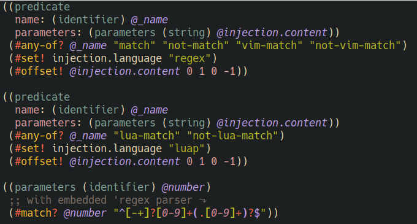

# Tree-sitter query major mode using tree-sitter

[](https://www.gnu.org/licenses/gpl-3.0)

This package provides a major-mode for tree-sitter queries (nvim) using the tree-sitter 
grammar from [tree-sitter-query](https://github.com/nvim-treesitter/tree-sitter-query)

Features:
- indentation
- font-locking
- structural navigation with treesitter objects

To use the embedded regex parser to parse regexes in `match` predicates, install
`regex-ts` from [tree-sitter-regex](https://github.com/tree-sitter/tree-sitter-regex)



## Installing

Emacs 29.1 or above with tree-sitter support is required. 

### Install tree-sitter parsers

Add the sources to `treesit-language-source-alist` and run 
`treesit-install-language-grammar`.

```elisp
(let ((treesit-language-source-alist
       '((query "https://github.com/nvim-treesitter/tree-sitter-query")
         (regex "https://github.com/tree-sitter/tree-sitter-regex"))))
  (dolist (parser (mapcar #'car treesit-language-source-alist))
    (treesit-install-language-grammar parser)))
```
